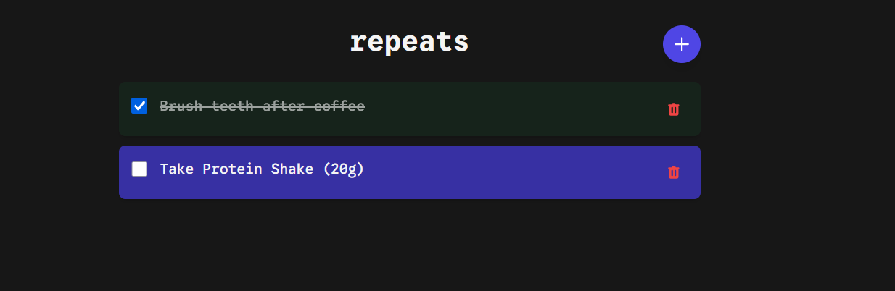

# Repeats

A simple, single-user web application for tracking daily repeating tasks. Tasks automatically reset each day, making it perfect for maintaining daily habits and routines.

## Features

- **Daily Task Management**: Create tasks that automatically reset every day
- **Specific Days**: Schedule tasks for chosen weekdays only (e.g. Mon/Wed/Fri); tasks not due today are tucked into a collapsible "not today" section
- **Time of Day**: Optionally tag tasks as morning, afternoon or evening; when any of today's tasks are tagged the list is grouped under those headings (untagged tasks count as afternoon)
- **Streaks**: Each task shows a 🔥 count of consecutive scheduled days completed
- **Simple Interface**: Clean, minimal design focused on task completion
- **Task Completion Tracking**: Mark tasks as complete with a single click
- **Persistent History**: All completion data is stored for potential future analytics
- **Dark Mode**: Automatically adapts to your system's color scheme preference
- **Responsive Design**: Works seamlessly on desktop and mobile devices
- **History**: Shows the last 7 days of task history
- **Notes**: Quick, collapsed note-taking under your repeats: write how the day went and optionally rate mood and performance (1–5). Add as many notes a day as you like; earlier ones stay out of the way. Click the **notes** title for a month calendar coloured by average mood or performance, with each day's notes (and backdated notes) — click **repeats** to go back
- **Countdowns**: Track upcoming dates with named countdown widgets showing days remaining
- **Weekly Workout Plan**: Shows this week's planned workouts from [intervals.icu](https://intervals.icu) in a horizontal day-by-day strip (sport, duration, training load; click a workout to expand its full description)
- **Cycleability Score (CS)**: A 0–10 score for how good it is to ride outdoors, from the [Met Éireann](https://www.met.ie) forecast (rain, wind, gusts, feels-like temperature, wet/icy roads). Shown for today (or tomorrow after sunset) with temperature, wind, rain and humidity, and as a badge on each planned outdoor ride using its planned start time (or the best daylight window if no time is set). Set `WEATHER_LAT`/`WEATHER_LON` to change location (defaults to Kimmage, Dublin)
- **Completed Rides (Strava)**: Completed rides are pulled from Strava and matched to the planned workout (or shown as "unplanned"), with a distance · time · elevation · NP · HR · PRs summary. Expand a ride to see its route and full stats. Needs `STRAVA_CLIENT_ID`, `STRAVA_CLIENT_SECRET` and `STRAVA_REFRESH_TOKEN` in `.env`; run `uv run python scripts/strava_auth.py` once to authorise and save the refresh token


## Technology Stack

- **Backend**: Flask (Python web framework)
- **Database**: SQLite (lightweight, file-based database)
- **Frontend**: HTMX for dynamic interactions without JavaScript
- **Styling**: Tailwind CSS with custom color palette
- **Font**: Google Sans Code
- **Server**: Gunicorn for production deployment

## Requirements

- Python 3.14 or higher
- Docker (for containerized deployment)

## Local Development

### Installation

1. Clone the repository:
```bash
git clone https://github.com/eoin71/repeats
cd repeats
```

2. Install dependencies using uv:
```bash
uv add flask
uv add flask-sqlalchemy
uv add gunicorn
```

### Running Locally

Start the development server:
```bash
uv run python run.py
```

The application will be available at `http://localhost:5000`

## Docker Deployment

### Quick Start (Production)

The easiest way to deploy is using the pre-built Docker Hub image:

1. Download the production docker-compose file or create `docker-compose.prod.yml`:
```yaml
version: '3.8'

services:
  web:
    image: eoin71/repeats:latest
    ports:
      - "5000:5000"
    volumes:
      - repeats-data:/app/instance
    environment:
      - FLASK_APP=run.py
      - FLASK_ENV=production
    restart: unless-stopped

volumes:
  repeats-data:
```

2. Start the application:
```bash
docker-compose -f docker-compose.prod.yml up -d
```

The application will be available at `http://localhost:5000`

**Benefits:**
- No build required - pulls pre-built multi-platform image (supports amd64 and arm64)
- Faster deployment
- Consistent across all environments
- Automatic updates by pulling latest image

### Development/Local Deployment

For local development or building from source:

1. Build and run with Docker Compose:
```bash
docker-compose up -d
```

2. View logs:
```bash
docker-compose logs -f
```

3. Stop the application:
```bash
docker-compose down
```

### Manual Docker Build

If you want to build the image yourself:

```bash
docker build -t repeats-app .
docker run -d -p 5000:5000 -v repeats-data:/app/instance --name repeats repeats-app
```

### Multi-Platform Builds

To build for multiple architectures (amd64, arm64):

```bash
docker buildx build --platform linux/amd64,linux/arm64 -t your-username/repeats:latest --push .
```

## How It Works

### Daily Reset Logic

The app uses a date-based completion system:

- Each task has a permanent record in the `tasks` table
- When you mark a task as complete, a record is created in the `task_completions` table with today's date
- The app checks if a completion record exists for today's date to determine if a task is complete
- Tomorrow, when the date changes, no completion record exists for the new date, so tasks appear incomplete again
- All historical completion data is preserved

### Countdowns

Countdowns let you track upcoming dates alongside your daily tasks:

- Add a countdown with a title and target date
- Each countdown displays the number of days remaining
- Shows "today" when the target date is the current day, and "X days ago" for past dates
- Countdowns are sorted by nearest date first

### Weekly Workout Plan

Between the tasks and countdowns, the app shows a horizontally scrollable Mon–Sun strip of planned workouts fetched live from intervals.icu:

- Each day card lists that day's workouts with a sport badge, name, duration and training load (TSS)
- Click a workout to expand its full description
- Today's card is highlighted
- Loaded asynchronously so the main page stays fast; if intervals.icu is unreachable the section degrades to a quiet empty state
- Requires `INTERVALS_ICU_API_KEY` (see Configuration)

### Database Schema

**tasks table:**
- `id`: Primary key
- `title`: Task name
- `description`: Optional task details
- `created_at`: Creation timestamp
- `active`: Boolean for soft deletes

**task_completions table:**
- `id`: Primary key
- `task_id`: Foreign key to tasks
- `completion_date`: Date the task was completed (DATE type)
- `completed_at`: Timestamp when marked complete
- Unique constraint on (task_id, completion_date) prevents duplicate completions

**countdowns table:**
- `id`: Primary key
- `title`: Countdown name
- `target_date`: The date being counted down to (DATE type)
- `active`: Boolean for soft deletes

## Project Structure

```
repeats/
├── app/
│   ├── __init__.py              # Flask app factory
│   ├── models.py                # Database models
│   ├── database.py              # Database initialization
│   ├── routes.py                # HTTP endpoints
│   ├── intervals.py             # intervals.icu API client (weekly workout plan)
│   ├── templates/               # HTML templates
│   │   ├── base.html            # Base template with styling
│   │   ├── index.html           # Main page
│   │   ├── _task_item.html      # Task card component
│   │   ├── _countdown_item.html # Countdown card component
│   │   ├── _workout_week.html   # Weekly workout plan strip
│   │   └── _history.html        # Completion history bar
│   └── static/                  # Static files (optional)
├── instance/                    # SQLite database location (gitignored)
├── run.py                       # Application entry point
├── Dockerfile                   # Docker configuration
├── docker-compose.yml           # Development Docker Compose
├── docker-compose.prod.yml      # Production Compose (Docker Hub)
└── pyproject.toml               # Python dependencies
```

## Configuration

### Environment Variables

- `FLASK_APP`: Set to `run.py` (default in production)
- `FLASK_ENV`: Set to `production` for deployment
- `INTERVALS_ICU_API_KEY`: **Required for the workout plan section.** Your intervals.icu API key from `/settings` on intervals.icu. Loaded automatically from `.env` in local development; pass it through `env_file`/`environment` in Docker.
- `INTERVALS_ICU_ATHLETE_ID`: Optional. Override athlete id discovery (auto-detected from the API key if unset).

### Gunicorn Settings

The production deployment uses Gunicorn with:
- 4 worker processes
- 120-second timeout
- Binding to `0.0.0.0:5000`

## Data Persistence

The SQLite database is stored in the `instance/` directory.

**Docker Volumes:**
- **Production (docker-compose.prod.yml)**: Uses a named Docker volume `repeats-data` for automatic management and portability
- **Development (docker-compose.yml)**: Uses a named Docker volume for consistent behavior
- **Manual runs**: Use `-v repeats-data:/app/instance` or bind mount with `-v ./instance:/app/instance`

Named volumes are recommended as they:
- Handle permissions correctly across platforms
- Are managed by Docker
- Work consistently on all operating systems
- Survive container deletion

To backup your data:
```bash
docker run --rm -v repeats-data:/data -v $(pwd):/backup alpine tar czf /backup/repeats-backup.tar.gz -C /data .
```

To restore from backup:
```bash
docker run --rm -v repeats-data:/data -v $(pwd):/backup alpine tar xzf /backup/repeats-backup.tar.gz -C /data
```

## Customization

### Changing Colors

The color palette is defined in `app/templates/base.html` in the Tailwind configuration. You can customize the primary, secondary, accent, and danger colors by modifying the color values in the `tailwind.config` object.

### Modifying Task Behavior

To change how tasks reset (e.g., weekly instead of daily), modify the `is_completed_today()` method in `app/models.py` and adjust the date comparison logic in `app/routes.py`.

## License

This project is licensed under the MIT License - see the [LICENSE](LICENSE) file for details.
